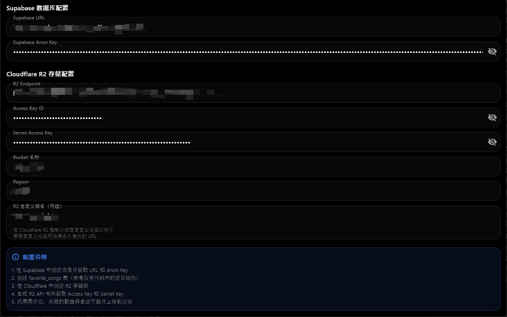
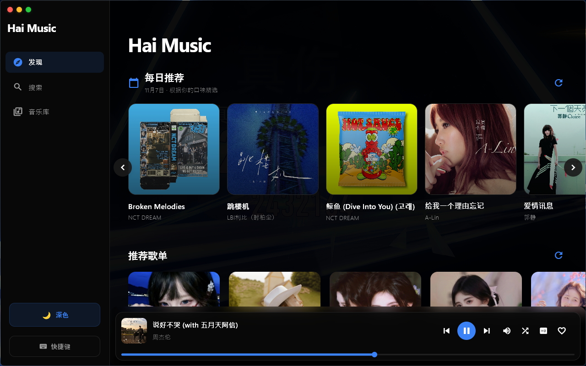

# Hai Music 🎵

一款功能丰富的跨平台音乐播放器，支持 Windows、Android 和 Web 平台。通过"我喜欢"功能构建个人音乐库，支持本地存储和云端同步，打造属于自己的音乐收藏系统。界面美观现代，支持多主题切换，提供流畅的音乐播放体验。

## ✨ 应用截图

<div align="center">

<p><strong>云端同步配置页面</strong></p>


<p><strong>Windows 端主页面</strong></p>


<p><strong>手机端主页</strong></p>


</div>

## 🎯 核心功能

### ❤️ 个人音乐库（核心功能）

- **我喜欢**：一键收藏喜爱的歌曲，构建个人音乐库
- **本地存储**：收藏的歌曲自动下载到本地，支持离线播放
- **云端同步**：可选配置 Supabase + Cloudflare R2 实现多设备同步
- **播放全部**：支持播放全部收藏歌曲
- **收藏管理**：查看、播放、删除收藏的歌曲

### 🎼 音乐播放

- **在线搜索**：支持腾讯音乐搜索
- **播放控制**：播放/暂停、上一首/下一首、进度调节、音量控制
- **播放模式**：顺序播放、单曲循环、随机播放
- **音质选择**：标准、HQ、HQ+、SQ无损、Hi-Res、杜比全景声、臻品、臻品母带2.0
- **无缝切换**：播放中切换音质自动重载，保持播放位置
- **歌词显示**：支持 LRC 格式歌词显示
- **键盘快捷键**：支持空格播放/暂停等快捷操作（桌面端）
- **定时关闭**：自定义定时时长，到时间后自动暂停播放，支持延长和取消

### 📚 音乐发现与管理

- **发现页面**：每日推荐歌曲和推荐歌单
- **搜索功能**：快速搜索歌曲，支持搜索历史
- **我喜欢**：查看和管理所有收藏的歌曲
- **最近播放**：自动记录播放历史（最多 50 条）
- **歌单管理**：支持 QQ 音乐歌单导入和播放

### 🎨 界面设计

- **现代化 UI**：采用 Material Design 设计规范
- **毛玻璃效果**：精美的背景模糊和半透明效果
- **多主题支持**：支持深色、浅色、紫色、蓝色、粉色、橙色、绿色、彩虹等多种主题
- **响应式布局**：自适应桌面和移动端界面
- **流畅动画**：页面切换和交互动画流畅自然

### 💾 缓存管理

- **智能缓存**：自动缓存音频文件和封面图片
- **缓存过期**：实现 7 天缓存过期机制
- **容量统计**：实时显示缓存占用空间
- **一键清理**：快速清理音频和封面缓存
- **离线播放**：已缓存的歌曲支持离线播放

### ☁️ 云端同步（可选）

- **Supabase 数据库**：存储歌曲元数据
- **Cloudflare R2**：存储音频文件和封面图片
- **自动同步**：收藏时自动上传到云端
- **多设备访问**：在不同设备间同步收藏列表

## 🛠️ 技术栈

### 核心框架

- **Flutter 3.0+** - 跨平台 UI 框架
- **Dart 3.0+** - 编程语言

### 状态管理

- **Provider 6.1+** - 轻量级状态管理

### UI 组件

- **Shimmer** - 加载骨架屏
- **Cached Network Image** - 图片缓存

### 音频播放

- **Just Audio** - 音频播放引擎（移动端）
- **Just Audio Media Kit** - 音频播放引擎（桌面端，基于 media\_kit/libmpv）
- **Media Kit Libs Windows Audio** - Windows 平台音频库
- **Audio Service** - 后台播放服务

### 网络请求

- **Dio 5.4+** - HTTP 客户端

### 数据存储

- **Shared Preferences** - 本地配置存储
- **Flutter Secure Storage** - 安全存储（API 密钥等）
- **Path Provider** - 文件路径管理
- **Supabase Flutter** - 云端数据库
- **Minio** - S3 兼容对象存储（用于 R2）

### 本地音频

- **On Audio Query** - 本地音频文件扫描
- **Audio Metadata Reader** - 音频元数据读取

### 其他

- **Package Info Plus** - 应用信息获取
- **Flutter Lyric** - 歌词解析和显示
- **Flutter Cache Manager** - 缓存管理

### 桌面端特性

- **Bitsdojo Window** - 自定义窗口样式
- **Flutter Acrylic** - 亚克力/毛玻璃效果

## 🚀 快速开始

### 环境要求

- **Flutter SDK**: 3.0.0 或更高版本
- **Dart SDK**: 3.0.0 或更高版本
- **Android Studio** / **VS Code**（推荐安装 Flutter 插件）

**平台特定要求：**

- **Windows**: Visual Studio 2022（包含 C++ 桌面开发组件）
- **Android**: Android SDK（API 21+）
- **Web**: Chrome 浏览器

### 安装步骤

1. **克隆项目**

```bash
git clone <repository-url>
cd haiMusic
```

1. **安装依赖**

```bash
flutter pub get
```

1. **运行应用**

```bash
# Windows 桌面端
flutter run -d windows
# 或使用批处理文件
run_windows.bat

# Android 端（需连接设备或启动模拟器）
flutter run -d android
# 或使用批处理文件
run_android.bat

# Web 端
flutter run -d chrome
```

## 📦 构建发布

### Windows 应用

```bash
flutter build windows --release
```

产物位置：`build\windows\x64\runner\Release\`

### Android APK

```bash
# 标准构建
flutter build apk --release

# 按 ABI 拆分（减小体积）
flutter build apk --release --split-per-abi
```

产物位置：`build\app\outputs\flutter-apk\`

### Web 应用

```bash
flutter build web --release
```

产物位置：`build\web\`

## ⚙️ 配置说明

### 云端同步配置

如需启用云端同步功能，请参考详细配置指南：

📖 **[云端同步配置指南](docs/CLOUD_SYNC_GUIDE.md)**

主要步骤：

1. 创建 Supabase 项目并执行 `docs/SETUP_DATABASE.sql`
2. 创建 Cloudflare R2 存储桶并获取 API 密钥
3. 在应用内"音乐库"页面点击云朵图标进行配置

### 应用图标更新

如需自定义应用图标，请参考：

📖 **[图标更新指南](docs/UPDATE_ICON_GUIDE.md)**

## 📁 项目结构

```
lib/
├── config/                   # 应用配置
│   └── app_constants.dart    # 常量定义（API、缓存、播放配置等）
├── extensions/               # Dart 扩展
│   ├── duration_extension.dart
│   ├── favorite_song_extension.dart
│   └── string_extension.dart
├── models/                   # 数据模型
│   ├── song.dart             # 歌曲模型
│   ├── favorite_song.dart    # 收藏歌曲模型
│   ├── downloaded_song.dart  # 下载歌曲模型
│   ├── play_history.dart     # 播放历史模型
│   ├── playlist.dart         # 歌单模型
│   ├── play_mode.dart        # 播放模式
│   ├── audio_quality.dart    # 音质配置（8级音质、分类、图标、渐变色、无障碍语义）
│   └── storage_config.dart   # 云存储配置
├── providers/                # 状态管理
│   ├── music_provider.dart   # 音乐播放状态
│   └── theme_provider.dart   # 主题状态
├── screens/                  # 页面
│   ├── home_screen.dart      # 主页（导航框架）
│   ├── discover_screen.dart  # 发现页
│   ├── search_screen.dart    # 搜索页
│   ├── library_screen.dart   # 音乐库
│   ├── favorites_screen.dart # 我喜欢
│   ├── downloaded_songs_screen.dart # 下载管理
│   ├── recent_play_screen.dart # 最近播放
│   ├── playlist_detail_screen.dart # 歌单详情
│   ├── player_screen.dart    # 播放器页面
│   ├── download_progress_screen.dart # 下载进度
│   ├── storage_config_screen.dart # 云存储配置
│   ├── discover/             # 发现页子组件
│   ├── downloaded/           # 下载页子组件
│   ├── library/              # 音乐库子组件
│   ├── player/               # 播放器子组件
│   ├── playlist/             # 歌单子组件
│   └── search/               # 搜索子组件
├── services/                 # 业务服务
│   ├── music_api_service.dart # 音乐 API 接口
│   ├── audio_handler_service.dart # 音频播放处理
│   ├── audio_player_interface.dart # 播放器接口
│   ├── audio_player_factory.dart # 播放器工厂
│   ├── mobile_audio_player.dart # 移动端播放器
│   ├── media_kit_desktop_player.dart # 桌面端播放器
│   ├── audio_service_manager.dart # 音频服务管理
│   ├── playback_controller_service.dart # 播放控制（含音质无缝切换）
│   ├── favorite_manager_service.dart # 收藏管理
│   ├── play_history_service.dart # 播放历史
│   ├── playlist_manager_service.dart # 歌单管理
│   ├── playlist_scraper_service.dart # 歌单抓取
│   ├── download_service.dart # 下载服务
│   ├── download_manager.dart # 下载管理器
│   ├── supabase_service.dart # Supabase 数据库
│   ├── r2_storage_service.dart # R2 对象存储
│   ├── storage_config_service.dart # 存储配置
│   ├── storage_path_manager.dart # 存储路径管理
│   ├── cache_manager_service.dart # 缓存管理
│   ├── smart_cache_service.dart # 智能缓存
│   ├── data_cache_service.dart # 数据缓存
│   ├── lyrics_service.dart   # 歌词服务
│   ├── lyrics_cache_service.dart # 歌词缓存
│   ├── lyrics_loading_service.dart # 歌词加载
│   ├── song_url_service.dart # 歌曲URL服务（音质关联缓存、forceRefresh）
│   ├── audio_quality_service.dart # 音质服务
│   ├── dio_client.dart       # 网络客户端
│   ├── preferences_service.dart # 偏好设置
│   ├── clipboard_config_parser.dart # 剪贴板配置解析
│   ├── keyboard_shortcut_service.dart # 键盘快捷键
│   ├── sleep_timer_service.dart # 睡眠定时器
│   └── local_audio_scanner.dart # 本地音频扫描
├── theme/                    # 主题样式
│   └── app_styles.dart       # 应用样式定义
├── utils/                    # 工具类
│   ├── platform_utils.dart   # 平台判断
│   ├── responsive.dart       # 响应式布局
│   ├── logger.dart           # 日志工具
│   ├── format_utils.dart     # 格式化工具
│   ├── cache_utils.dart      # 缓存工具
│   └── result.dart           # 结果类型
├── widgets/                  # 可复用组件
│   ├── mini_player.dart      # 迷你播放器
│   ├── theme_selector.dart   # 主题选择器
│   ├── audio_quality_selector.dart # 音质选择器（响应式布局、分组卡片、动画、无障碍）
│   └── draggable_window_area.dart # 可拖拽窗口区域
├── window_config.dart        # 窗口配置（桌面端）
└── main.dart                 # 应用入口
```

## 💡 使用说明

### 搜索和播放音乐

1. 打开应用，进入"搜索"页面
2. 输入歌曲名或歌手名
3. 点击搜索结果中的歌曲即可播放
4. 使用底部迷你播放器控制播放
5. 点击迷你播放器可展开完整播放页面

### 收藏歌曲

1. 播放任意歌曲
2. 点击播放器或迷你播放器上的 ❤️ 图标
3. 歌曲将自动添加到"我喜欢"列表
4. 如启用云同步，将自动下载并上传到云端

### 查看收藏

1. 进入"音乐库"页面
2. 点击"❤️ 我喜欢"卡片
3. 查看所有收藏的歌曲
4. 点击"播放全部"可播放所有收藏

### 导入 QQ 音乐歌单

1. 进入"音乐库"页面
2. 首次使用会提示输入 QQ 号
3. 输入后自动加载该 QQ 号的歌单
4. 点击歌单卡片查看和播放歌单内容

### 定时关闭

1. 在播放页面点击右上角菜单（三个点）
2. 选择"定时关闭"
3. 使用时间选择器自定义时长（支持小时和分钟）
4. 点击"开始定时"启动定时器
5. 定时器激活后，播放器顶部会显示倒计时
6. 点击倒计时可以延长15分钟或取消定时
7. 到时间后自动暂停播放

### 切换音质

1. 在播放页面点击音质按钮（显示当前音质标签，如"HQ"、"SQ"等）
2. 在弹出的音质选择面板中选择想要的音质
3. 如果正在播放，会自动重新加载当前歌曲的新音质版本
4. 切换完成后保持原来的播放位置和播放状态

**可用音质：**

| 音质      | 标签     | 格式                     | 说明      |
| ------- | ------ | ---------------------- | ------- |
| 标准音质    | 标准     | MP3 128kbps            | 节省流量    |
| HQ高音质   | HQ     | MP3 320kbps            | 高品质MP3  |
| HQ增强    | HQ+    | MP3 320kbps+           | 增强高品质   |
| SQ无损    | SQ     | FLAC                   | 无损压缩    |
| Hi-Res  | Hi-Res | FLAC 24bit/96kHz       | 高解析度    |
| 杜比全景声   | 杜比     | EC3 Dolby Atmos        | 沉浸式空间音频 |
| 臻品全景声   | 臻品     | FLAC 360 Reality Audio | 360度全景声 |
| 臻品母带2.0 | 母带     | FLAC 24bit/192kHz      | 最高音质    |

### 清理缓存

1. 进入"音乐库"页面
2. 向下滚动找到"缓存管理"区域
3. 查看当前缓存大小
4. 点击"清理缓存"按钮清空缓存

## 🔧 本地存储

应用数据存储位置：

- **Windows**: `C:\Users\<用户名>\Documents\music\`
- **Android**: `/data/data/com.example.hai_music/files/music/`

目录结构：

```
music/
├── audio/          # 音频文件缓存
│   └── <songId>.mp3  # MP3格式（标准/HQ/HQ+）
│   └── <songId>.flac # FLAC格式（SQ无损/Hi-Res/臻品/臻品母带）
│   └── <songId>.ec3  # EC3格式（杜比全景声）
└── covers/         # 封面图片缓存
    └── <songId>.jpg
```

## ❓ 常见问题

### 无法播放音乐？

- 检查网络连接是否正常
- 确认音乐 API 服务可访问
- 尝试切换音质后重新播放

### Android 构建缓慢？

- 首次构建需要下载依赖，耗时较长属正常现象
- 后续构建会利用 Gradle 缓存，速度会显著提升
- 可以使用 `--split-per-abi` 参数减小 APK 体积

### Windows 应用图标未更新？

- 确保已替换 `windows/runner/resources/app_icon.ico`
- 重新执行 `flutter build windows --release`
- 清理构建缓存：`flutter clean`

### 云同步无法使用？

- 检查 Supabase 和 R2 配置是否正确
- 确认网络连接正常
- 查看应用日志获取详细错误信息

## 🗺️ 开发路线

**已完成功能：**

- [x] 基础音乐播放功能（播放/暂停/上下曲/进度/音量）
- [x] 在线搜索（腾讯音乐 API）
- [x] 播放模式（顺序/单曲循环/随机）
- [x] 音质选择（标准/HQ/HQ+/SQ无损/Hi-Res/杜比/臻品/臻品母带2.0）
- [x] 播放中无缝切换音质（自动重载，保持播放位置）
- [x] 收藏管理和本地存储
- [x] 云端同步（Supabase + Cloudflare R2）
- [x] 最近播放历史（最多 50 条）
- [x] 缓存管理和清理
- [x] 多主题支持
- [x] 歌词显示（LRC 格式）
- [x] 键盘快捷键（桌面端）
- [x] 定时关闭（自定义时长，支持延长和取消）
- [x] 响应式布局（桌面/移动端自适应）
- [x] 每日推荐和推荐歌单
- [x] QQ 音乐歌单导入
- [x] 后台播放（Android）
- [x] 毛玻璃效果和现代化 UI

## 📈 技术优化

### 网络请求优化

- [x] 实现网络请求重试机制（最多 3 次重试）
- [x] 增强错误处理和日志记录
- [x] 添加响应拦截器，统一处理网络错误

### 缓存策略优化

- [x] 实现缓存过期管理（7 天过期）
- [x] 添加单个缓存清理功能
- [x] 实现缓存优化功能，自动清理过期缓存
- [x] 增强缓存统计信息，显示过期缓存数量

### 性能优化

- [x] 实现音频预加载功能，减少歌曲切换等待时间
- [x] 优化歌单加载逻辑，支持分页加载
- [x] 实现搜索防抖，减少不必要的网络请求

### 安全性增强

- [x] 确保所有网络请求使用 HTTPS
- [x] 无硬编码 API 密钥
- [x] 增强错误处理，避免敏感信息泄露

### 用户体验改进

- [x] 统一的加载状态和错误提示处理
- [x] 搜索防抖，减少不必要的网络请求
- [x] 响应式布局，自适应桌面和移动端

### 测试覆盖

- [x] 为关键服务编写单元测试
- [x] 验证核心功能的正确性
- [x] 确保代码质量和稳定性

## 🧪 测试

项目包含单元测试，确保核心功能的正确性：

```bash
# 运行所有测试
flutter test

# 运行特定测试文件
flutter test test/services/dio_client_test.dart
flutter test test/services/smart_cache_service_test.dart
```

测试覆盖的服务和模块：

**模型测试：**

- AudioQuality（音质配置）
- DownloadedSong（下载歌曲）
- FavoriteSong（收藏歌曲）
- PlayHistory（播放历史）
- PlayMode（播放模式）
- Playlist（歌单）
- Song（歌曲）
- StorageConfig（存储配置）

**服务测试：**

- DioClient（网络请求客户端）
- LyricsLoadingService（歌词加载服务）
- PlaylistManagerService（歌单管理服务）
- SmartCacheService（智能缓存服务）
- StorageConfigService（存储配置服务）

**工具测试：**

- CacheUtils（缓存工具）
- FormatUtils（格式化工具）
- Result（结果类型）

## 📄 开源协议

本项目采用 MIT 协议开源。

## 🙏 鸣谢

感谢以下开源项目：

- Flutter 团队及社区
- 所有依赖包的开发者
- 音乐 API 提供方

***

**注意**：本应用仅供学习交流使用，请勿用于商业用途。音乐版权归原作者所有。
